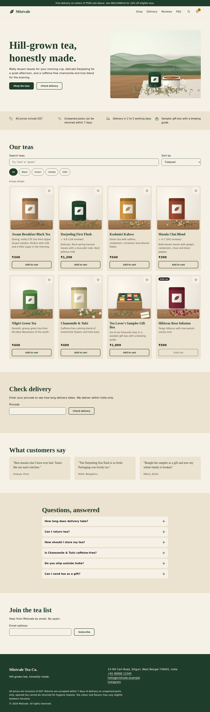
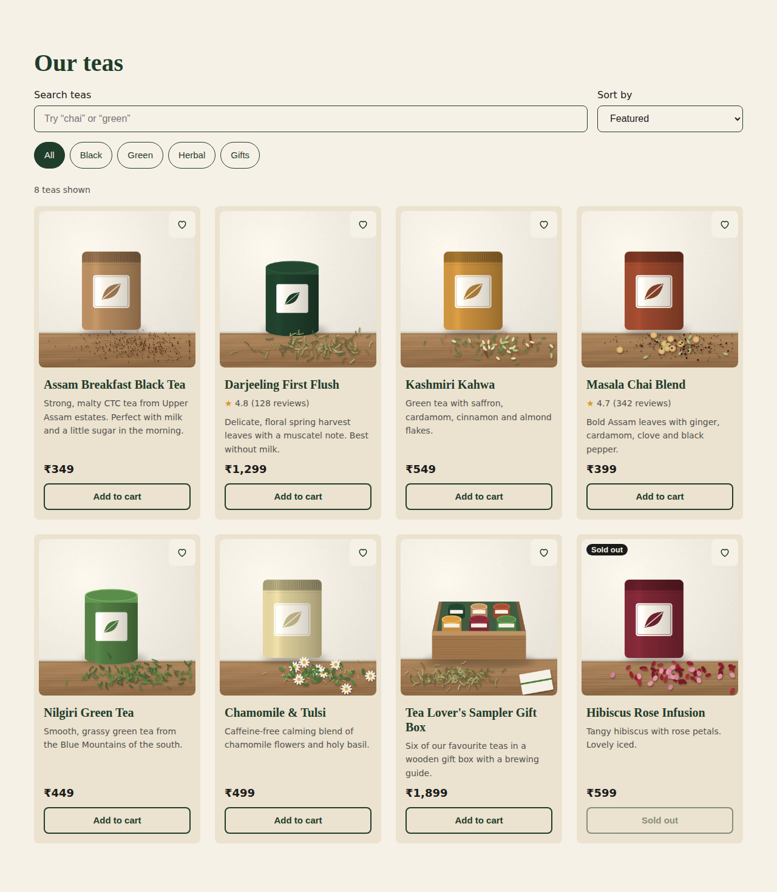
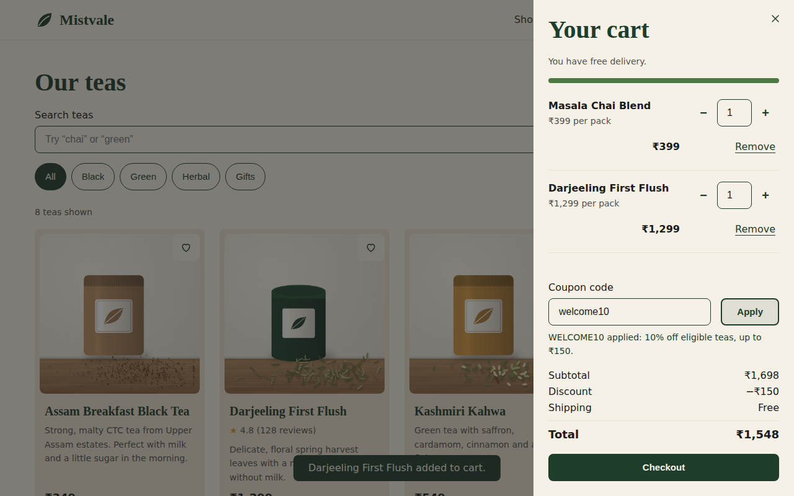
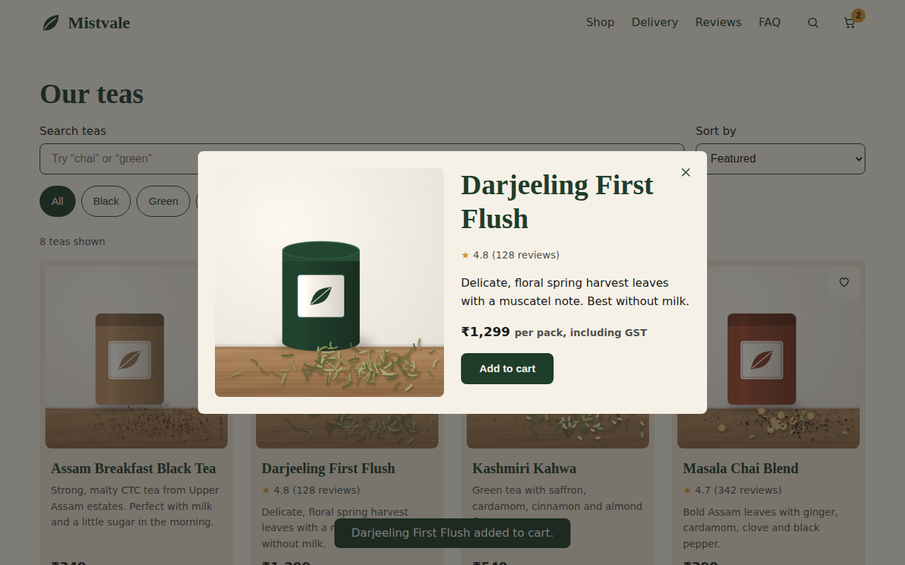
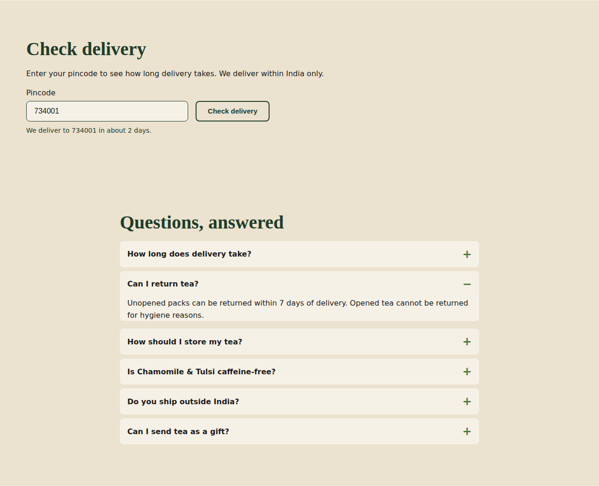
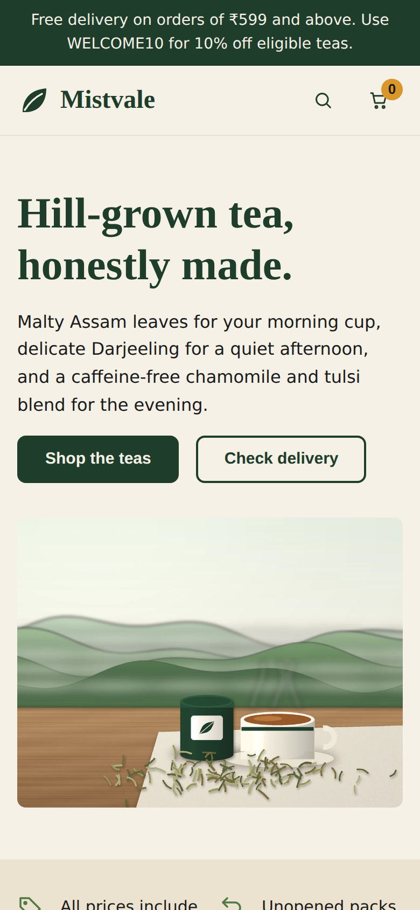
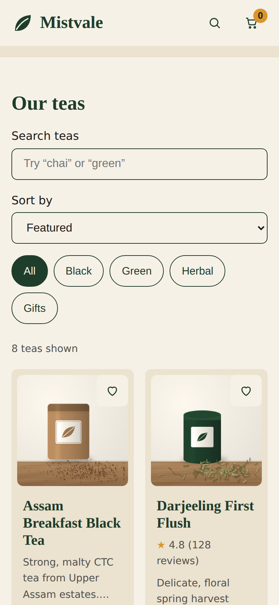
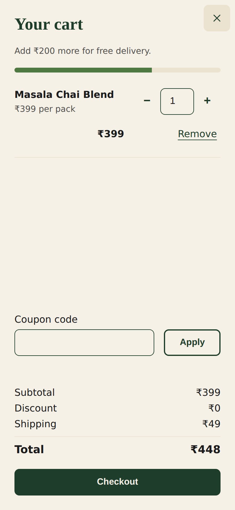

# Mistvale Tea Co. store

A rescued and redesigned one-page tea store for **Mistvale Tea Co.** ("Hill-grown tea, honestly made."), built as a developer assessment for MeroxIO.

The original page worked on paper but looked amateur, broke the cart maths, ignored the business rules and was hard to use. This version fixes the bugs, follows the brand guide, and is built as a single `index.html` with plain HTML, CSS and JavaScript. There are no frameworks or libraries.

## Screenshots

### Desktop home page



### Shop grid

Search, category filter and sort work together. Sold-out teas always sort last.



### Cart drawer

Quantity stepper, free-shipping meter, coupon message and full totals.



### Quick view



### Delivery check and FAQ



### Mobile (390px wide)

<p align="center">
  
  
  
</p>

> The screenshots were captured in an offline sandbox, so Google Fonts could not load and the page shows fallback fonts instead of Fraunces and Inter. For final screenshots, open `index.html` in Chrome on your machine and recapture.

## Features

- **Business rules built in**
  - Prices always come from `PRODUCTS` and include GST.
  - Maximum of 5 per tea, and never more than stock.
  - **WELCOME10:** 10% off eligible items (gift boxes excluded), capped at ₹150, with a ₹399 minimum cart. Case-insensitive, and applying it twice changes nothing.
  - Shipping is ₹49, free when the amount after discount reaches the threshold.
  - Only the final total is rounded. Amounts use ₹ with Indian digit grouping.
  - Sold-out teas can't be added and always sort last.
  - Delivery check uses `API.checkPincode()`, shows days, "not serviceable" or an invalid-pincode message, and never gets stuck.
- **Shopping experience:** always-visible add buttons, toast confirmation, quick view, cart drawer, saved wishlist (browser only), header search button and empty-result state.
- **Design:** seven brand colours as CSS variables, Fraunces and Inter, an 8px spacing scale, one corner radius, button hover/focus/active/disabled states, and subtle motion that respects `prefers-reduced-motion`.
- **Sections in brand order:** announcement strip, header, hero, trust strip, shop, delivery check, reviews, FAQ, newsletter and footer.
- **Accessible:** native `<dialog>` for cart and quick view, `aria-live` messages, visible form labels, keyboard focus rings and a skip link.
- **SEO:** title, description, canonical, Open Graph and Twitter tags, plus JSON-LD for the store, the FAQ and every product.

## Project structure

```
.
├── index.html        # the whole store (HTML, CSS and JS)
├── images/           # 8 product images, hero banner, logo
├── screenshots/      # images used in this README
├── NOTES.md          # what changed, AI mistakes, open questions
├── PROMPTS.md        # AI prompt log
└── README.md
```

## Run it locally

No server or build step is needed. Open `index.html` in a browser (Chrome is best). Product images are WebP files in `images/`.

## Checkout contract

The hidden form `#checkout-form` posts to `https://mistvale.example/cart/checkout` with two fields. That address does not exist, so an error page after clicking **Checkout** is expected.

| Field | Value |
|---|---|
| `items` | JSON such as `[{"id":104,"qty":1}]` |
| `coupon` | the applied code, or empty |

## Quick manual test cases

| Cart | Expected result |
|---|---|
| Darjeeling First Flush × 1 | Total ₹1,299, shipping free |
| Masala Chai × 1, code `welcome10` | Discount ₹39.90, shipping ₹49, total ₹408 |
| Assam × 1, code `WELCOME10` | Rejected (needs ₹399) |
| Sampler gift box × 1, code `WELCOME10` | Rejected (gift boxes not eligible) |
| Masala Chai + Sampler, code `WELCOME10` | Discount ₹39.90 (10% of the tea only) |
| Click Add to cart 6 times on one tea | Stays at 5 |
| Hibiscus Rose Infusion | Add button disabled, always last in the list |
| Pincode `734001` | "about 2 days" |
| Pincode `123` | Invalid pincode message |

## Testing status

An automated headless-Chromium script ran 23 checks against these cases (cart maths, coupon rules, 5-item cap, sorting, fast-typing search, pincode messages, checkout payload, no JS errors, no sideways scroll at 360px), and all passed. Manual testing in real browsers, keyboard-only use and Lighthouse are covered in `NOTES.md`.

## Images

All images are illustrations drawn with Python (Pillow) code, not photographs or output of an image generator. The product images are square 800×800 WebP files under 150 KB each, the hero is 1200×900 WebP under 250 KB, and the logo is an SVG with outlined text. They contain no baked-in text apart from the logo.

## Open questions

Several details in the original page were contradictory or unproven, such as the free-shipping threshold (₹499 vs ₹599), a countdown that had already ended, and claims like "As seen on Shark Tank India". They are listed in **NOTES.md** under *Questions for the team*.

## Constraints followed

- One HTML file, no frameworks or libraries (Google Fonts only)
- `PRODUCTS` ids, names and prices unchanged
- `API` object untouched
- Footer legal text unchanged
- Only facts from `BRAND.md` and `PRODUCTS`; no invented reviews, ratings, awards or numbers

## Publish on GitHub

```bash
git init
git add index.html images screenshots NOTES.md PROMPTS.md README.md
git commit -m "Mistvale store: fixes, redesign and images"
git branch -M main
git remote add origin https://github.com/<your-username>/<your-repo>.git
git push -u origin main
```

To get a live page, turn on **GitHub Pages** (Settings → Pages → deploy from the `main` branch). The store then loads at `https://<your-username>.github.io/<your-repo>/`.
